# MD基本语法大全

[Markdown 入门教程](https://www.wenjiangs.com/doc/markdown-markdownclassdiagram)

> **环境说明**：
> 考虑到 Markdown 工具之间的不兼容，有的内容直接从页面复制粘贴到本地不会正常显示，大家学习时自己动手写是肯定没问题的。本节所有实例代码及演示效果均使用 Typora 工具完成。
> Mermaid 为 Markdown 扩展语法，需要在 Typora 设置中开启对图表的语法支持。其方式为：「设置」->「Markdown」->「Markdown 扩展语法」-> 勾选「图表」


## 1、横向流程图源码格式


```
​```mermaid
graph LR
A[方形] -->B(圆角)
B --> C{条件a}
C -->|分支说明 a=1| D[结果1]
C -->|分支说明 a=2| E[结果2]
​```
```


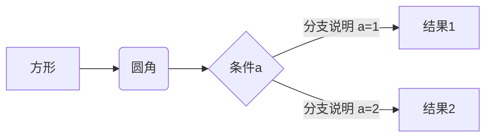

## 2、竖向流程图源码格式

```
​```mermaid
graph TD
A[方形] -->B(圆角)
B --> C{条件a}
C -->|分支说明 a=1| D[结果1]
C -->|分支说明 a=2| E[结果2]
​```
```


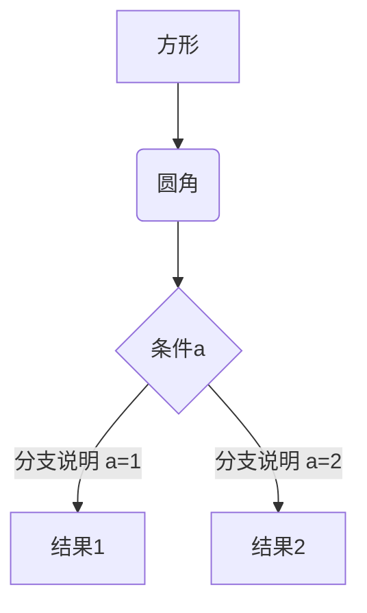

## 3、标准流程图源码格式（竖向）

```
​```flow
st=>start: 开始框
op=>operation: 处理框
cond=>condition: 判断框(是或否?)
sub1=>subroutine: 子流程
io=>inputoutput: 输入输出框
e=>end: 结束框
st->op->cond
cond(yes)->io->e
cond(no)->sub1(right)->op
​```
```

```flow
st=>start: 开始框
op=>operation: 处理框
cond=>condition: 判断框(是或否?)
sub1=>subroutine: 子流程
io=>inputoutput: 输入输出框
e=>end: 结束框
st->op->cond
cond(yes)->io->e
cond(no)->sub1(right)->op
```

## 4、标准流程图源码格式（横向）

```
​```flow
st=>start: 开始框
op=>operation: 处理框
cond=>condition: 判断框(是或否?)
sub1=>subroutine: 子流程
io=>inputoutput: 输入输出框
e=>end: 结束框
st(right)->op(right)->cond
cond(yes)->io(bottom)->e
cond(no)->sub1(right)->op
​```
```

```flow
st=>start: 开始框
op=>operation: 处理框
cond=>condition: 判断框(是或否?)
sub1=>subroutine: 子流程
io=>inputoutput: 输入输出框
e=>end: 结束框
st(right)->op(right)->cond
cond(yes)->io(bottom)->e
cond(no)->sub1(right)->op
```

## 5、UML时序图源码样例

```
​```sequence
对象A->对象B: 对象B你好吗?（请求）
Note right of 对象B: 对象B的描述
Note left of 对象A: 对象A的描述(提示)
对象B-->对象A: 我很好(响应)
对象A->对象B: 你真的好吗？
​```
```

```sequence
对象A->对象B: 对象B你好吗?（请求）
Note right of 对象B: 对象B的描述
Note left of 对象A: 对象A的描述(提示)
对象B-->对象A: 我很好(响应)
对象A->对象B: 你真的好吗？
```

## 6、UML时序图源码复杂样例

```
​```sequence
Title: 标题：复杂使用
对象A->对象B: 对象B你好吗?（请求）
Note right of 对象B: 对象B的描述
Note left of 对象A: 对象A的描述(提示)
对象B-->对象A: 我很好(响应)
对象B->小三: 你好吗
小三-->>对象A: 对象B找我了
对象A->对象B: 你真的好吗？
Note over 小三,对象B: 我们是朋友
participant C
Note right of C: 没人陪我玩
​```
```

```sequence
Title: 标题：复杂使用
对象A->对象B: 对象B你好吗?（请求）
Note right of 对象B: 对象B的描述
Note left of 对象A: 对象A的描述(提示)
对象B-->对象A: 我很好(响应)
对象B->小三: 你好吗
小三-->>对象A: 对象B找我了
对象A->对象B: 你真的好吗？
Note over 小三,对象B: 我们是朋友
participant C
Note right of C: 没人陪我玩
```

## 7、UML标准时序图样例

```
​```mermaid
%% 时序图例子,-> 直线，-->虚线，->>实线箭头
  sequenceDiagram
    participant 张三
    participant 李四
    张三->王五: 王五你好吗？
    loop 健康检查
        王五->王五: 与疾病战斗
    end
    Note right of 王五: 合理 食物 <br/>看医生...
    李四-->>张三: 很好!
    王五->李四: 你怎么样?
    李四-->王五: 很好!
​```
```

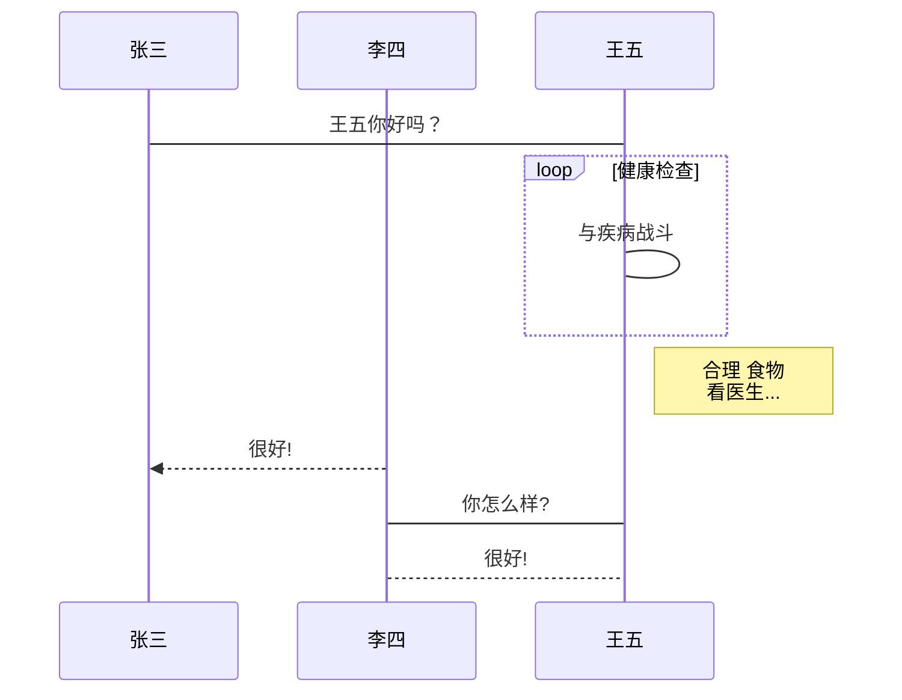


~~~markdown
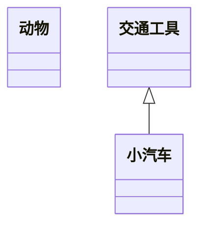
~~~


~~~markdown
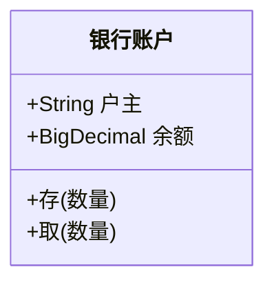
~~~


## 8、甘特图样例

```
​```mermaid
%% 语法示例
        gantt
        dateFormat  YYYY-MM-DD
        title 软件开发甘特图
        section 设计
        需求                      :done,    des1, 2014-01-06,2014-01-08
        原型                      :active,  des2, 2014-01-09, 3d
        UI设计                     :         des3, after des2, 5d
    未来任务                     :         des4, after des3, 5d
        section 开发
        学习准备理解需求                      :crit, done, 2014-01-06,24h
        设计框架                             :crit, done, after des2, 2d
        开发                                 :crit, active, 3d
        未来任务                              :crit, 5d
        耍                                   :2d
        section 测试
        功能测试                              :active, a1, after des3, 3d
        压力测试                               :after a1  , 20h
        测试报告                               : 48h
​```
```

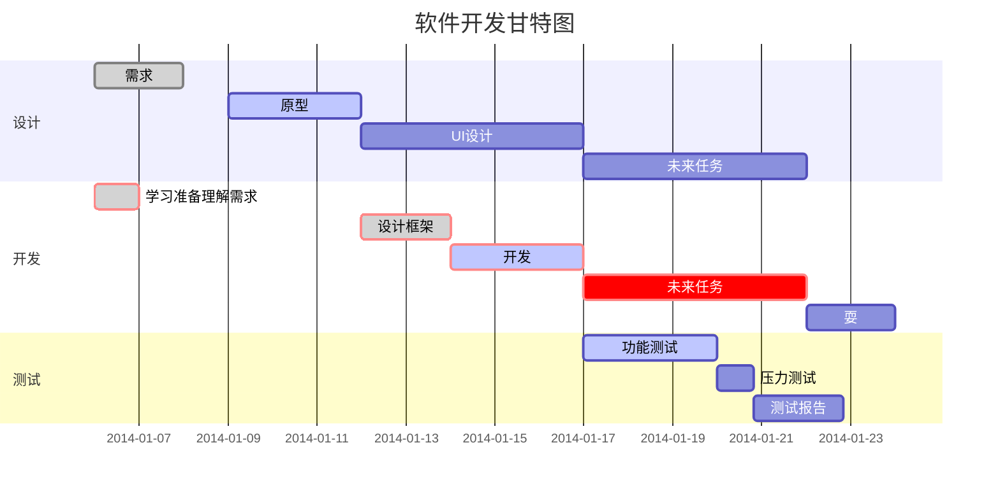


## 9、UML类图

### **实例 1**：类图的「类」

~~~markdown
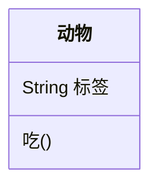
~~~

此部分代码将会渲染成如下效果：


### **实例 2**：类的定义

类的定义有两种方式，第一种是形如 `class Animal` 这样的直接描述，另一种是通过关系来定义类，如 `Vehicle <|-- Car`。

~~~markdown

~~~

渲染效果如下：


### **实例 3**：使用「冒号」声明类成员。

类成员包含属性、方法；区分属性和方法的语法依赖于是否以`「小括号 ()」`结尾，没有括号的成员会被解释为属性，有括号的成员会被解释为方法。

成员的作用域作为可选项，定义是在成员的开头，有以下四种：

- `+` Public
- `-` Private
- `#` Protected
- `~` Package/Internal

除此之外，通过在 `()` 后面增加 「星号 `*`」和「美元符号 `$`」，可以用来描述方法成员的抽象或静态属性。

类成员有两种定义方法。

~~~markdown

~~~

其渲染效果如下：


### **实例 4**：使用 「大括号」确定类对象的成员描述。

~~~markdown
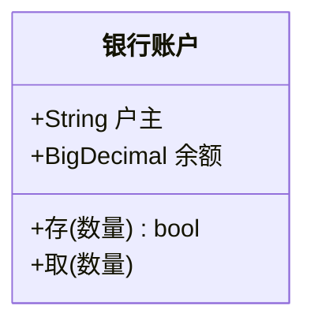
~~~

其渲染效果如下：


### **实例 5**：给方法成员设置入参及返回值

通过在「小括号」结尾处增加数据类型描述，我们可以给方法成员设置入参及返回值。

~~~markdown
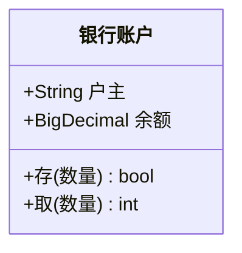
~~~


### **实例 6**：类图中的「关系」各种连线类型展示

类图中「类」之间的逻辑关系由连接线表示，定义的形式如：`[类A][箭头][类B]:标签文字`。

不同的逻辑关系定义如下：

| Type   | Description |
| :----- | :---------- |
| `<|--` | 继承关系    |
| `*--`  | 组成关系    |
| `o--`  | 集合关系    |
| `-->`  | 关联关系    |
| `--`   | 实现连接    |
| `..>`  | 依赖关系    |
| `..|>` | 实现关系    |
| `..`   | 虚线连接    |


~~~markdown
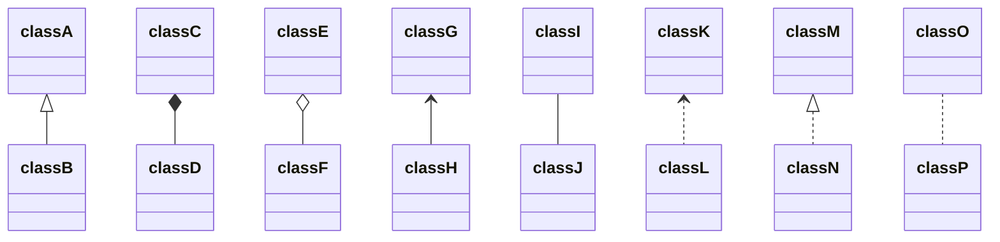
~~~

渲染结果如下：


还可以为关系加上标签。

### **实例 7**：在类图连接线上增加标签。

~~~markdown
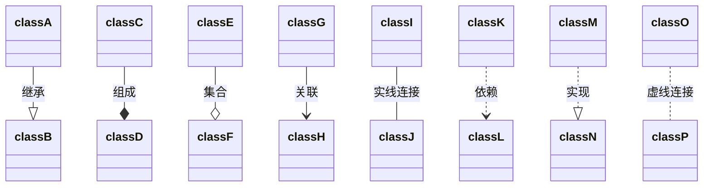
~~~

渲染效果如下：

```mermaid
classDiagram
  classA --|> classB : 继承
  classC --* classD : 组成
  classE --o classF : 集合
  classG --> classH : 关联
  classI -- classJ : 实线连接
  classK ..> classL : 依赖
  classM ..|> classN : 实现
  classO .. classP : 虚线连接
```

### **实例 8**：不同基数关系的定义。

~~~markdown
```mermaid
classDiagram
    顾客 "1" --> "*" 票据
    学生 "1" --> "1..*" 课程
    银河 --> "many" 星星 : 包含
```
~~~

其渲染效果如下：

```mermaid
classDiagram
    顾客 "1" --> "*" 票据
    学生 "1" --> "1..*" 课程
    银河 --> "many" 星星 : 包含
```


### **实例 9**：类修饰符：在类名称下面另起一行：

~~~markdown
```mermaid
classDiagram
  class 形状
  <<interface>> 形状
```
~~~

其渲染效果如下：

```mermaid
classDiagram
  class 形状
  <<interface>> 形状
```

### **实例 10**： 类修饰符：在嵌套结构内的首行定义：

~~~markdown
```mermaid
classDiagram
class 形状 {
    <<interface>>
    定点数
    绘制()
}
```
~~~

其渲染效果如下：

```mermaid
classDiagram
class 形状 {
    <<interface>>
    定点数
    绘制()
}
```


### 实例 11：一个关于动物的类图。

~~~markdown
```mermaid
classDiagram
	鸟 --|> 动物 : 继承
  翅膀 "2" --> "1" 鸟 : 组合
  动物 ..> 氧气 : 依赖
  动物 ..> 水 : 依赖
  
	class 动物 {
    <<interface>>
    +有生命
    +新陈代谢(氧气, 水)
    +繁殖()
	}
	
	class 鸟 {
		+羽毛
		+有角质喙没有牙齿
		+下蛋()
	}
	class 鸟 {
		+羽毛
		+有角质喙没有牙齿
		+下蛋()
	}
```
~~~

其渲染效果如下：

```mermaid
classDiagram
	鸟 --|> 动物 : 继承
  翅膀 "2" --> "1" 鸟 : 组合
  动物 ..> 氧气 : 依赖
  动物 ..> 水 : 依赖
  
	class 动物 {
    <<interface>>
    +有生命
    +新陈代谢(氧气, 水)
    +繁殖()
	}
	
	class 鸟 {
		+羽毛
		+有角质喙没有牙齿
		+下蛋()
	}
	class 鸟 {
		+羽毛
		+有角质喙没有牙齿
		+下蛋()
	}
```


